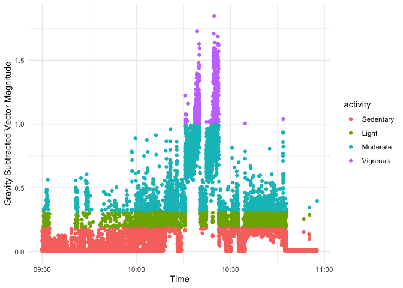

```r
#read in data
p1_hip <- read.csv("p1_right hip.csv", skip = 99, header = FALSE, col.names = c("time", "x_axis", "y_axis", "z_axis", "lux", "button", "temp")) 
```

```
## Warning in readLines(file, skip): line 27 appears to contain an embedded nul
```

```
## Warning in readLines(file, skip): line 31 appears to contain an embedded nul
```

```
## Warning in readLines(file, skip): line 32 appears to contain an embedded nul
```

```
## Warning in readLines(file, skip): line 33 appears to contain an embedded nul
```

```
## Warning in readLines(file, skip): line 34 appears to contain an embedded nul
```

```
## Warning in readLines(file, skip): line 35 appears to contain an embedded nul
```

```r
p1_wrist <- read.csv("p1_right wrist.csv", skip = 99, header = FALSE, col.names = c("time", "x_axis", "y_axis", "z_axis", "lux", "button", "temp"))
```

```
## Warning in readLines(file, skip): line 27 appears to contain an embedded nul
```

```
## Warning in readLines(file, skip): line 31 appears to contain an embedded nul
```

```
## Warning in readLines(file, skip): line 32 appears to contain an embedded nul
```

```
## Warning in readLines(file, skip): line 33 appears to contain an embedded nul
```

```
## Warning in readLines(file, skip): line 34 appears to contain an embedded nul
```

```
## Warning in readLines(file, skip): line 35 appears to contain an embedded nul
```

```r
p2_hip <- read.csv("p2_right hip.csv", skip = 99, header = FALSE, col.names = c("time", "x_axis", "y_axis", "z_axis", "lux", "button", "temp"))
```

```
## Warning in readLines(file, skip): line 27 appears to contain an embedded nul
```

```
## Warning in readLines(file, skip): line 31 appears to contain an embedded nul
```

```
## Warning in readLines(file, skip): line 32 appears to contain an embedded nul
```

```
## Warning in readLines(file, skip): line 33 appears to contain an embedded nul
```

```
## Warning in readLines(file, skip): line 34 appears to contain an embedded nul
```

```
## Warning in readLines(file, skip): line 35 appears to contain an embedded nul
```

```r
p2_wrist <- read.csv("p2_right wrist.csv", skip = 99, header = FALSE, col.names = c("time", "x_axis", "y_axis", "z_axis", "lux", "button", "temp"))
```

```
## Warning in readLines(file, skip): line 27 appears to contain an embedded nul
```

```
## Warning in readLines(file, skip): line 31 appears to contain an embedded nul
```

```
## Warning in readLines(file, skip): line 32 appears to contain an embedded nul
```

```
## Warning in readLines(file, skip): line 33 appears to contain an embedded nul
```

```
## Warning in readLines(file, skip): line 34 appears to contain an embedded nul
```

```
## Warning in readLines(file, skip): line 35 appears to contain an embedded nul
```


```r
head(p1_hip)
```

<div class="kable-table">

|time                    | x_axis|  y_axis|  z_axis| lux| button| temp|
|:-----------------------|------:|-------:|-------:|---:|------:|----:|
|2017-08-29 09:30:00:500 | 0.0100| -0.0217| -1.0131| 381|      0| 31.6|
|2017-08-29 09:30:00:510 | 0.0139| -0.0177| -1.0131| 398|      0| 31.6|
|2017-08-29 09:30:00:520 | 0.0218| -0.0098| -1.0091| 414|      0| 31.6|
|2017-08-29 09:30:00:530 | 0.0377| -0.0376| -1.0131| 414|      0| 31.6|
|2017-08-29 09:30:00:540 | 0.0179| -0.0336| -1.0051| 414|      0| 31.6|
|2017-08-29 09:30:00:550 | 0.0060| -0.0297| -1.0051| 398|      0| 31.6|

</div>

```r
head(p1_wrist)
```

<div class="kable-table">

|time                    |  x_axis|  y_axis|  z_axis| lux| button| temp|
|:-----------------------|-------:|-------:|-------:|---:|------:|----:|
|2017-08-29 09:30:00:500 | -0.9659| -0.0579| -0.4145| 138|      0| 32.7|
|2017-08-29 09:30:00:510 | -1.0550| -0.0740| -0.4829| 138|      0| 32.7|
|2017-08-29 09:30:00:520 | -1.1157| -0.0821| -0.4749| 156|      0| 32.7|
|2017-08-29 09:30:00:530 | -1.1116| -0.1303| -0.3623| 156|      0| 32.7|
|2017-08-29 09:30:00:540 | -1.0752| -0.1625| -0.4588| 138|      0| 32.7|
|2017-08-29 09:30:00:550 | -1.0550| -0.0981| -0.5633| 156|      0| 32.7|

</div>

```r
head(p2_hip)
```

<div class="kable-table">

|time                    | x_axis|  y_axis|  z_axis| lux| button| temp|
|:-----------------------|------:|-------:|-------:|---:|------:|----:|
|2017-08-29 09:30:00:500 | 0.0159|  0.0069| -0.9974| 202|      0| 30.3|
|2017-08-29 09:30:00:510 | 0.0079|  0.0030| -1.0015| 185|      0| 30.3|
|2017-08-29 09:30:00:520 | 0.0239|  0.0030| -1.0015| 202|      0| 30.3|
|2017-08-29 09:30:00:530 | 0.0079|  0.0148| -0.9853| 202|      0| 30.3|
|2017-08-29 09:30:00:540 | 0.0119| -0.0010| -0.9893| 202|      0| 30.3|
|2017-08-29 09:30:00:550 | 0.0239| -0.0128| -0.9934| 202|      0| 30.3|

</div>

```r
head(p2_wrist)
```

<div class="kable-table">

|time                    |  x_axis|  y_axis|  z_axis| lux| button| temp|
|:-----------------------|-------:|-------:|-------:|---:|------:|----:|
|2017-08-29 09:30:00:500 | -0.6057| -0.6495| -0.4931|  49|      0| 32.7|
|2017-08-29 09:30:00:510 | -0.6097| -0.6375| -0.4931|  49|      0| 32.7|
|2017-08-29 09:30:00:520 | -0.6057| -0.6334| -0.4972|  49|      0| 32.7|
|2017-08-29 09:30:00:530 | -0.6176| -0.6294| -0.5094|  49|      0| 32.7|
|2017-08-29 09:30:00:540 | -0.6097| -0.6495| -0.5094|  49|      0| 32.7|
|2017-08-29 09:30:00:550 | -0.6057| -0.6415| -0.5094|  49|      0| 32.7|

</div>


```r
#mutating the data
p1_hip <- p1_hip %>% 
            mutate(id = "P1", loc = "hip")
p1_wrist <- p1_wrist %>% 
            mutate(id = "P1", loc = "wrist")
p2_hip <- p2_hip %>% 
            mutate(id = "P2", loc = "hip")
p2_wrist <- p2_wrist %>% 
            mutate(id = "P2", loc = "wrist")
```


```r
head(p1_hip)
```

<div class="kable-table">

|time                    | x_axis|  y_axis|  z_axis| lux| button| temp|id |loc |
|:-----------------------|------:|-------:|-------:|---:|------:|----:|:--|:---|
|2017-08-29 09:30:00:500 | 0.0100| -0.0217| -1.0131| 381|      0| 31.6|P1 |hip |
|2017-08-29 09:30:00:510 | 0.0139| -0.0177| -1.0131| 398|      0| 31.6|P1 |hip |
|2017-08-29 09:30:00:520 | 0.0218| -0.0098| -1.0091| 414|      0| 31.6|P1 |hip |
|2017-08-29 09:30:00:530 | 0.0377| -0.0376| -1.0131| 414|      0| 31.6|P1 |hip |
|2017-08-29 09:30:00:540 | 0.0179| -0.0336| -1.0051| 414|      0| 31.6|P1 |hip |
|2017-08-29 09:30:00:550 | 0.0060| -0.0297| -1.0051| 398|      0| 31.6|P1 |hip |

</div>

```r
head(p2_wrist)
```

<div class="kable-table">

|time                    |  x_axis|  y_axis|  z_axis| lux| button| temp|id |loc   |
|:-----------------------|-------:|-------:|-------:|---:|------:|----:|:--|:-----|
|2017-08-29 09:30:00:500 | -0.6057| -0.6495| -0.4931|  49|      0| 32.7|P2 |wrist |
|2017-08-29 09:30:00:510 | -0.6097| -0.6375| -0.4931|  49|      0| 32.7|P2 |wrist |
|2017-08-29 09:30:00:520 | -0.6057| -0.6334| -0.4972|  49|      0| 32.7|P2 |wrist |
|2017-08-29 09:30:00:530 | -0.6176| -0.6294| -0.5094|  49|      0| 32.7|P2 |wrist |
|2017-08-29 09:30:00:540 | -0.6097| -0.6495| -0.5094|  49|      0| 32.7|P2 |wrist |
|2017-08-29 09:30:00:550 | -0.6057| -0.6415| -0.5094|  49|      0| 32.7|P2 |wrist |

</div>


```r
accel_df <- bind_rows(p1_hip, p1_wrist, p2_hip, p2_wrist)
glimpse(accel_df)
```

```
## Rows: 2,005,500
## Columns: 9
## $ time   <chr> "2017-08-29 09:30:00:500", "2017-08-29 09:30:00:510", "2017-08-…
## $ x_axis <dbl> 0.0100, 0.0139, 0.0218, 0.0377, 0.0179, 0.0060, 0.0179, 0.0218,…
## $ y_axis <dbl> -0.0217, -0.0177, -0.0098, -0.0376, -0.0336, -0.0297, -0.0297, …
## $ z_axis <dbl> -1.0131, -1.0131, -1.0091, -1.0131, -1.0051, -1.0051, -1.0091, …
## $ lux    <int> 381, 398, 414, 414, 414, 398, 398, 414, 414, 414, 414, 414, 381…
## $ button <int> 0, 0, 0, 0, 0, 0, 0, 0, 0, 0, 0, 0, 0, 0, 0, 0, 0, 0, 0, 0, 0, …
## $ temp   <dbl> 31.6, 31.6, 31.6, 31.6, 31.6, 31.6, 31.6, 31.6, 31.6, 31.6, 31.…
## $ id     <chr> "P1", "P1", "P1", "P1", "P1", "P1", "P1", "P1", "P1", "P1", "P1…
## $ loc    <chr> "hip", "hip", "hip", "hip", "hip", "hip", "hip", "hip", "hip", …
```


```r
#converting time to date time
accel_df$time <- as.POSIXct(accel_df$time)
accel_df$time <- lubridate::ymd_hms(accel_df$time)
```


```r
#calculating the gravity subtracted vector magnitude
accel_df$g_vec_mag <- sqrt(accel_df$x_axis^2 + accel_df$y_axis^2 + accel_df$z_axis^2)-1
```


```r
accel_df$tc <- cut(accel_df$time, breaks = "1 sec")

glimpse(accel_df)
```

```
## Rows: 2,005,500
## Columns: 11
## $ time      <dttm> 2017-08-29 09:30:00, 2017-08-29 09:30:00, 2017-08-29 09:30:…
## $ x_axis    <dbl> 0.0100, 0.0139, 0.0218, 0.0377, 0.0179, 0.0060, 0.0179, 0.02…
## $ y_axis    <dbl> -0.0217, -0.0177, -0.0098, -0.0376, -0.0336, -0.0297, -0.029…
## $ z_axis    <dbl> -1.0131, -1.0131, -1.0091, -1.0131, -1.0051, -1.0051, -1.009…
## $ lux       <int> 381, 398, 414, 414, 414, 398, 398, 414, 414, 414, 414, 414, …
## $ button    <int> 0, 0, 0, 0, 0, 0, 0, 0, 0, 0, 0, 0, 0, 0, 0, 0, 0, 0, 0, 0, …
## $ temp      <dbl> 31.6, 31.6, 31.6, 31.6, 31.6, 31.6, 31.6, 31.6, 31.6, 31.6, …
## $ id        <chr> "P1", "P1", "P1", "P1", "P1", "P1", "P1", "P1", "P1", "P1", …
## $ loc       <chr> "hip", "hip", "hip", "hip", "hip", "hip", "hip", "hip", "hip…
## $ g_vec_mag <dbl> 0.013381715, 0.013349944, 0.009383024, 0.014498231, 0.005820…
## $ tc        <fct> 2017-08-29 09:30:00, 2017-08-29 09:30:00, 2017-08-29 09:30:0…
```


```r
accel_agg <- accel_df %>%
              group_by(tc, id, loc) %>%
              summarize(time = first(time),
                        g_vec_mag = mean(abs(g_vec_mag)),
                        sd_x = sd(x_axis),
                        sd_y = sd(y_axis),
                        sd_z = sd(z_axis)
                        ) %>%
              select(time, id, loc, g_vec_mag, sd_x, sd_y, sd_z)
```

```
## `summarise()` has grouped output by 'tc', 'id'. You can override using the `.groups` argument.
```

```
## Adding missing grouping variables: `tc`
```

```r
head(accel_agg)
```

<div class="kable-table">

|tc                  |time                |id |loc   | g_vec_mag|      sd_x|      sd_y|      sd_z|
|:-------------------|:-------------------|:--|:-----|---------:|---------:|---------:|---------:|
|2017-08-29 09:30:00 |2017-08-29 09:30:00 |P1 |hip   | 0.0082643| 0.0078386| 0.0089129| 0.0077685|
|2017-08-29 09:30:00 |2017-08-29 09:30:00 |P1 |wrist | 0.1636527| 0.1740579| 0.0880720| 0.1120757|
|2017-08-29 09:30:00 |2017-08-29 09:30:00 |P2 |hip   | 0.0074451| 0.0077751| 0.0066538| 0.0088460|
|2017-08-29 09:30:00 |2017-08-29 09:30:00 |P2 |wrist | 0.0192453| 0.0063793| 0.0078948| 0.0098096|
|2017-08-29 09:30:01 |2017-08-29 09:30:01 |P1 |hip   | 0.0070402| 0.0082307| 0.0076042| 0.0071287|
|2017-08-29 09:30:01 |2017-08-29 09:30:01 |P1 |wrist | 0.0862964| 0.1292836| 0.0692255| 0.1449216|

</div>


```r
summary(accel_agg)
```

```
##                    tc             time                          id           
##  2017-08-29 09:30:00:    4   Min.   :2017-08-29 09:30:00   Length:20059      
##  2017-08-29 09:30:01:    4   1st Qu.:2017-08-29 09:50:53   Class :character  
##  2017-08-29 09:30:02:    4   Median :2017-08-29 10:11:47   Mode  :character  
##  2017-08-29 09:30:03:    4   Mean   :2017-08-29 10:11:51                     
##  2017-08-29 09:30:04:    4   3rd Qu.:2017-08-29 10:32:40                     
##  2017-08-29 09:30:05:    4   Max.   :2017-08-29 10:57:39                     
##  (Other)            :20035                                                   
##      loc              g_vec_mag             sd_x               sd_y         
##  Length:20059       Min.   :0.005100   Min.   :0.003315   Min.   :0.003479  
##  Class :character   1st Qu.:0.009222   1st Qu.:0.007880   1st Qu.:0.007260  
##  Mode  :character   Median :0.073481   Median :0.101758   Median :0.084678  
##                     Mean   :0.199987   Mean   :0.243840   Mean   :0.185981  
##                     3rd Qu.:0.278038   3rd Qu.:0.303751   3rd Qu.:0.249812  
##                     Max.   :1.845207   Max.   :2.157539   Max.   :1.855834  
##                                                                             
##       sd_z         
##  Min.   :0.005634  
##  1st Qu.:0.008966  
##  Median :0.100044  
##  Mean   :0.163476  
##  3rd Qu.:0.212789  
##  Max.   :1.968616  
## 
```


```r
accel_agg <- accel_agg %>%
	              mutate(activity = case_when(
		                  g_vec_mag <= 0.1900 ~ "Sedentary",
		                  g_vec_mag > 0.19001 & g_vec_mag <= 0.314 ~ "Light",
		                  g_vec_mag >  0.314001 & g_vec_mag <= 0.99989 ~ "Moderate",
		                  g_vec_mag > 0.999 ~ "Vigorous",
		                  TRUE ~ "other"
	              ))
```


```r
accel_agg$activity <- factor(accel_agg$activity, levels = c("Sedentary","Light","Moderate","Vigorous"))
table(accel_agg$activity)
```

```
## 
## Sedentary     Light  Moderate  Vigorous 
##     11944      4145      3520       450
```


```r
accel_fig <- ggplot(accel_agg, aes(x = time, y = g_vec_mag)) + 
                geom_point(aes(colour = activity)) + 
                xlab("Time") +
                ylab("Gravity Subtracted Vector Magnitude") +
                theme_minimal()
plot(accel_fig)
```

<!-- -->


