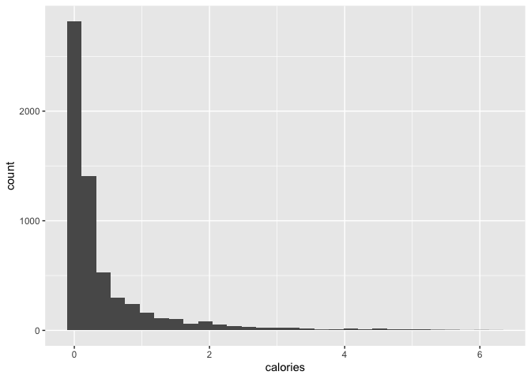
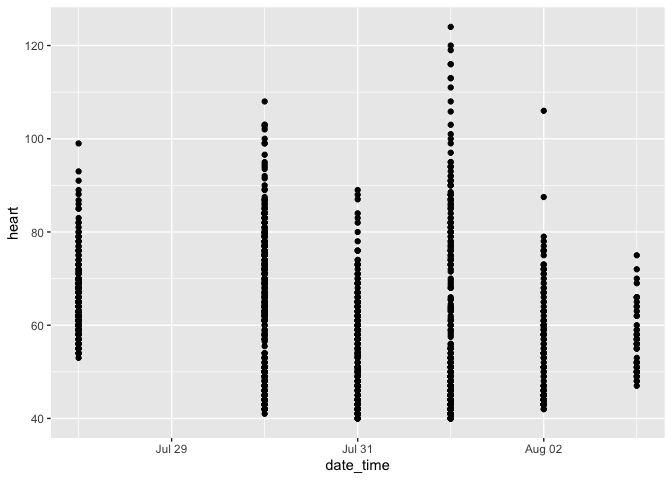
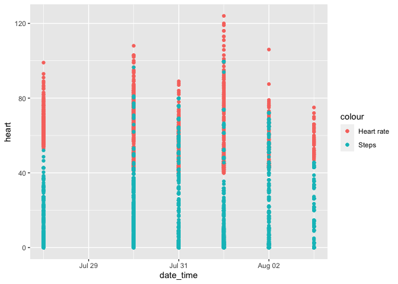

```r
#Reading in the data
aw_data <- read_csv("https://github.com/walkabilly/HKR6130_MUN/raw/master/data/apple_watch_data.csv")
```

```
## New names:
## * `` -> ...1
```

```
## Rows: 6137 Columns: 8
```

```
## ── Column specification ────────────────────────────────────────────────────────
## Delimiter: ","
## chr  (2): p_id, device_name
## dbl  (5): ...1, heart, calories, steps, distance
## dttm (1): date_time
```

```
## 
## ℹ Use `spec()` to retrieve the full column specification for this data.
## ℹ Specify the column types or set `show_col_types = FALSE` to quiet this message.
```


```r
glimpse(aw_data)
```

```
## Rows: 6,137
## Columns: 8
## $ ...1        <dbl> 1, 2, 3, 4, 5, 6, 7, 8, 9, 10, 11, 12, 13, 14, 15, 16, 17,…
## $ p_id        <chr> "participant1", "participant1", "participant1", "participa…
## $ device_name <chr> "Apple Watch", "Apple Watch", "Apple Watch", "Apple Watch"…
## $ date_time   <dttm> 2018-08-03 05:39:00, 2018-08-03 05:38:00, 2018-08-03 05:3…
## $ heart       <dbl> 0, 0, 0, 0, 0, 0, 0, 57, 0, 0, 0, 0, 0, 0, 0, 0, 70, 0, 0,…
## $ calories    <dbl> 0.1659708, 0.5745100, 0.7633688, 0.5179309, 0.5004473, 0.4…
## $ steps       <dbl> 0.000000, 0.000000, 0.000000, 0.000000, 0.000000, 0.000000…
## $ distance    <dbl> 0.000000, 0.000000, 0.000000, 0.000000, 0.000000, 0.000000…
```


```r
library(lubridate)
```

```
## 
## Attaching package: 'lubridate'
```

```
## The following objects are masked from 'package:base':
## 
##     date, intersect, setdiff, union
```

```r
aw_data$date_time <- as_date(aw_data$date_time)
table(aw_data$date_time)
```

```
## 
## 2018-07-28 2018-07-30 2018-07-31 2018-08-01 2018-08-02 2018-08-03 
##        628        849       1440       1440       1440        340
```

```r
max(aw_data$date_time) - min(aw_data$date_time)
```

```
## Time difference of 6 days
```


```r
summary(aw_data)
```

```
##       ...1          p_id           device_name          date_time         
##  Min.   :   1   Length:6137        Length:6137        Min.   :2018-07-28  
##  1st Qu.:1535   Class :character   Class :character   1st Qu.:2018-07-31  
##  Median :3069   Mode  :character   Mode  :character   Median :2018-08-01  
##  Mean   :3069                                         Mean   :2018-07-31  
##  3rd Qu.:4603                                         3rd Qu.:2018-08-02  
##  Max.   :6137                                         Max.   :2018-08-03  
##      heart           calories           steps            distance     
##  Min.   :  0.00   Min.   :0.00000   Min.   : 0.0000   Min.   : 0.000  
##  1st Qu.:  0.00   1st Qu.:0.00003   1st Qu.: 0.0000   1st Qu.: 0.000  
##  Median :  0.00   Median :0.14612   Median : 0.4258   Median : 0.309  
##  Mean   : 13.57   Mean   :0.45021   Mean   :10.1795   Mean   : 8.195  
##  3rd Qu.:  0.00   3rd Qu.:0.45252   3rd Qu.:13.6088   3rd Qu.:10.422  
##  Max.   :124.00   Max.   :6.24054   Max.   :99.5206   Max.   :86.714
```


```r
#Replacing zeros in heart rate with NA
aw_data <- aw_data %>%
              mutate(heart = na_if(heart, 0))
```


```r
#mean of heart rate
mean(aw_data$heart, na.rm = TRUE)
```

```
## [1] 59.53469
```

```r
sd(aw_data$heart, na.rm = T)
```

```
## [1] 14.79135
```

The average heart rate of 59.5bpm is somehow low, since the normal resting heart rate is between 60 and 100bpm. The standard deviation is on the high side, which means that the values are further away from the mean heart rate.


```r
sum(aw_data$calories)
```

```
## [1] 2762.934
```

```r
sum(aw_data$steps)
```

```
## [1] 62471.37
```

```r
sum(aw_data$distance)
```

```
## [1] 50291.28
```

The total number of steps is 62471 steps over 6 days, which seems average and plausible to me. The recommended steps per day is 10,000 steps a day.


```r
library(ggplot2)
ggplot(aw_data, aes(calories)) +
  geom_histogram()
```

```
## `stat_bin()` using `bins = 30`. Pick better value with `binwidth`.
```

<!-- -->

ggplot makes a plot in r and the geom adds a layer representing the particular plots you want to make.


```r
ggplot(aw_data, aes(x = date_time, y = heart)) +
  geom_point()
```

```
## Warning: Removed 4738 rows containing missing values (geom_point).
```

<!-- -->


```r
ggplot(aw_data, aes(x = date_time)) +
  geom_point(aes(y = heart, color = "Heart rate")) +
  geom_point(aes(y = steps, color = "Steps"))
```

```
## Warning: Removed 4738 rows containing missing values (geom_point).
```

<!-- -->

The geom layer is different for scatterplot because we use geom_point, while we use geom_histogram for histogram.
The above scatterplots showed that 
1. There is little to no difference in the heart rates over the 6 days, except for August first when it was higher.
2. Number of steps taken daily tends to generally decrease across the days
3. The higher the number of steps taken, the higher the heart rate.


```r
##Recoding steps
aw_data <- aw_data %>%
	            mutate(steps_cat = case_when(
		                  steps == 0 ~ "None",
		                  steps >=0 & steps <100 ~ "Low",
		                  steps >=100 & steps <200 ~ "High",
		                  TRUE ~ "other"
              ))
```


```r
table(aw_data$steps_cat)
```

```
## 
##  Low None 
## 3153 2984
```


```r
aw_data %>%
      group_by(steps_cat) %>%
      summarize(mean_hr = mean(heart, na.rm = TRUE), mean_cal = mean(calories, na.rm = TRUE))
```

<div class="kable-table">

|steps_cat |  mean_hr|  mean_cal|
|:---------|--------:|---------:|
|Low       | 63.03378| 0.8104390|
|None      | 54.47570| 0.0695778|

</div>

The functions are creating a more grouped data summary. The results make sense, more steps led to higher heart rate and more calories burned.

## Path B


```r
p1 <- read_csv("https://raw.githubusercontent.com/walkabilly/HKR6130_MUN/master/data/aw_data_p1.csv")
```

```
## Rows: 2062 Columns: 7
```

```
## ── Column specification ────────────────────────────────────────────────────────
## Delimiter: ","
## chr  (2): Username, DeviceName
## dbl  (4): Heart, Steps, Calories, Distance
## dttm (1): DateTime
```

```
## 
## ℹ Use `spec()` to retrieve the full column specification for this data.
## ℹ Specify the column types or set `show_col_types = FALSE` to quiet this message.
```

```r
p2 <- read_csv("https://raw.githubusercontent.com/walkabilly/HKR6130_MUN/master/data/aw_data_p2.csv")
```

```
## Rows: 1017 Columns: 7
```

```
## ── Column specification ────────────────────────────────────────────────────────
## Delimiter: ","
## chr  (2): Username, DeviceName
## dbl  (4): Heart, Steps, Calories, Distance
## dttm (1): DateTime
```

```
## 
## ℹ Use `spec()` to retrieve the full column specification for this data.
## ℹ Specify the column types or set `show_col_types = FALSE` to quiet this message.
```


```r
#merging the two participants
p1_p2 <- bind_rows(p1, p2)
```


```r
summary_p1_p2 <- p1_p2 %>%
                  group_by(Username) %>%
                  summarize(
                      mean_hr = mean(Heart, na.rm = TRUE),
                      sum_cal = sum(Calories),
                      sum_steps = sum(Steps),
                      sum_dist = sum(Distance)
                  )
summary_p1_p2
```

<div class="kable-table">

|Username     |  mean_hr|  sum_cal| sum_steps| sum_dist|
|:------------|--------:|--------:|---------:|--------:|
|participant1 | 14.95005| 1469.518|  35960.59| 28676.26|
|participant2 | 16.18296|  742.053|  24353.99| 18138.47|

</div>

From the above summary, participant 1 was more active than participant 2 due to the sum of calories, distance and steps being more than participant 2. It is however surprising that participant 2 had a higher mean heart rate than participant 1. Also the values of the heart rate 14 and 15 seems to be really low for a typical heart rate measurement.

## Extra


```r
#reading in participant 3
p3 <- read_csv("/Users/sumayyahmusa/Desktop/aw_data_p3.csv")
```

```
## Rows: 1381 Columns: 7
```

```
## ── Column specification ────────────────────────────────────────────────────────
## Delimiter: ","
## chr  (2): Username, DeviceName
## dbl  (4): Heart, Steps, Calories, Distance
## dttm (1): DateTime
```

```
## 
## ℹ Use `spec()` to retrieve the full column specification for this data.
## ℹ Specify the column types or set `show_col_types = FALSE` to quiet this message.
```


```r
#binding it to p1_p2
p1_p2_p3 <- bind_rows(p1_p2, p3)
```


```r
summary_data <- p1_p2_p3 %>%
                  group_by(Username) %>%
                  summarize(
                      mean_hr = mean(Heart, na.rm = TRUE)
                  )
summary_data
```

<div class="kable-table">

|Username     |  mean_hr|
|:------------|--------:|
|participant1 | 14.95005|
|participant2 | 16.18296|
|participant3 | 22.41812|

</div>

