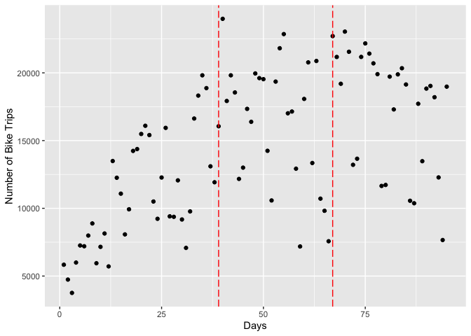

```r
boris <- read.csv("https://github.com/walkabilly/HKR6130_MUN/raw/master/data/boris_data.csv")

head(boris)
```

<div class="kable-table">

|  X|start_date | t_trip| strike| time|
|--:|:----------|------:|------:|----:|
|  1|30-Jul-10  |   5836|      0|    1|
|  2|31-Jul-10  |   4739|      0|    2|
|  3|01-Aug-10  |   3756|      0|    3|
|  4|02-Aug-10  |   5997|      0|    4|
|  5|03-Aug-10  |   7257|      0|    5|
|  6|04-Aug-10  |   7201|      0|    6|

</div>
### 1. Scatterplot of number of bike trips over days

Use the variable t_trip as the outcome and create a scatterplot of the data over time.


```r
trips_days_scatter <- ggplot(boris, aes(x = time, y = t_trip)) +
                      geom_point() + 
                      labs(x = "Days", y = "Number of Bike Trips")
plot(trips_days_scatter)
```

<!-- -->

We know the strikes happened on September 6th and October 4th. Add horizontal lines to the figure to shown when the strikes happened.


```r
trips_strikes_scatter <- ggplot(boris, aes(x = time, y = t_trip)) +
                      geom_point() + 
                      labs(x = "Days", y = "Number of Bike Trips") +
                      geom_vline(xintercept = c(39,67), colour="red", linetype = "longdash")
plot(trips_strikes_scatter)
```

<!-- -->

Let's use the function geom_smooth by group (strike) to get a sense of how the relationship is changing over time.


```r
trips_strikes_smooth <- ggplot(boris, aes(x = time, y = t_trip)) +
                      geom_point() + 
                      labs(x = "Days", y = "Number of Bike Trips") +
                      geom_vline(xintercept = c(39,67), colour="red", linetype = "longdash") +
                      geom_smooth(aes(group = strike), se = F) +
                      geom_smooth(method = "lm", aes(group = strike), colour = "purple", se = F)
                      
plot(trips_strikes_smooth)
```

```
## `geom_smooth()` using method = 'loess' and formula 'y ~ x'
```

```
## `geom_smooth()` using formula 'y ~ x'
```

<!-- -->

Calculate the average and standard deviation during each period (strike variable)


```r
boris_summ <- boris %>%
                group_by(strike) %>%
                summarise(m_trip = mean(t_trip), sd_trip = sd(t_trip))
boris_summ
```

<div class="kable-table">

| strike|   m_trip|  sd_trip|
|------:|--------:|--------:|
|      0| 10855.79| 4198.072|
|      1| 16379.82| 4556.545|
|      2| 17476.21| 4332.697|

</div>

Here we see that the average number of trips before the strike was 10856, after the first strike the average was 16380, and after the second strike the average was 17476 trips per day.


```r
write_csv(boris, "boris.csv")
```


